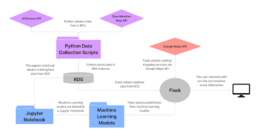
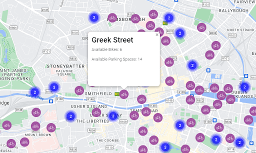
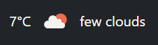
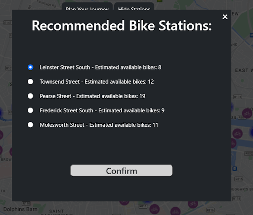
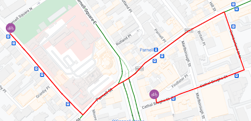
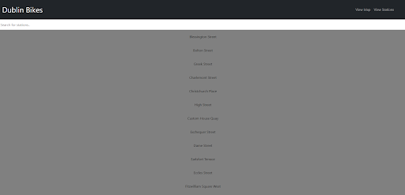
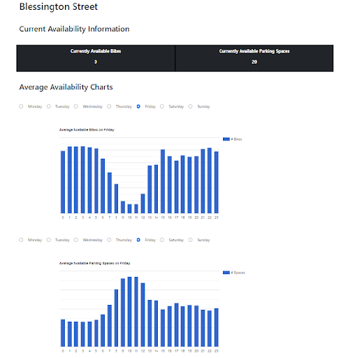

# Note: 
This application is no longer in operation

# Introduction

Dublin Bikes is a bicycle rental scheme which has operated since 2009 as a partnership between outdoor advertising company JCDecaux and Dublin City Council. It operates every day between the hours of 05:00 - 00:30 across 110 bike rental stations which contain both normal and electric bikes, as well as parking spaces where users can park their bikes when they are not using them.  It is estimated that close to 19 million journeys have been made since the scheme launched and that there are 42,000 annual subscribers. 

The aim of this project is to develop a standalone web application for Dublin bikes where users of the scheme will be able to check current station and parking space availability, current weather conditions, plan their journeys (by showing them directions between a starting and ending station) and give them bike/parking space availability estimates for journeys they plan to make in the near future. At a higher level, this project aims to reduce congestion in Dublin by improving the user experience of Dublin bike scheme participants. Our hope is that this will encourage more people to cycle into town, rather than drive or take the bus.

# Architecture

https://www.figma.com/file/8rK4KsFJHUVKPvBvjDRsqb/Dublin-Bikes-Architecture?node-id=0%3A1

# Site Overview

## Main Page

The first thing the user can see when he opens the app is the main page. This page contains the map with markers representing the station locations. There is a navigation bar at the top of the page containing links to the “view stations” page and “view map” page. Below the navigation bar, there are toggle buttons for the station markers and the journey planner side panel.

## Real-time Station Information

When the user clicks on the station markers, the name of the station and real-time availability information at this station is displayed.

## Real-time Weather Information

Real-time weather information is displayed in the middle of the navigation bar, which provides the user with the current temperature in degrees and the description of the weather.

## Journey Planner

Another feature that gets the user's attention is the journey planner side panel which is located on the left-hand side of the screen. The user can input some travel information into this side panel, and recommended starting/ending stations will be displayed.

When the user types in the departure location, destination location, chooses a day of the week, and a time of the day, a popup appears on the screen. This popup will show the user 5 recommended stations near their location sorted in descending order of distance from the user location. After choosing the recommended departure location, the popup will display the 5 recommended stations for the user to end their journey (park their bike) in descending order of distance from the user’s destination location.

When the user chooses the departure and destination stations, a route is created on the map, giving the user directions from their selected departure station to their selected destination station.

## View Stations

The user also has the option to select the “view stations” option in the navigation bar. Selecting this option will redirect the user to a page where all stations in Dublin are displayed. If the user is looking for a specific station, they can use the search bar at the top of the page, so they can filter the name of the stations, displaying only the desired station.

## Station Statistics

Each station is a link that will redirect the user to another page. On this page the user will be able to see the real-time bike/parking space availability information for that specific station and two charts. By default, the charts display the average available bikes and spaces on the current day of the week at different times of the day, but the user has the option to change the day of the week. Every page contains the same navigation bar that allows the user to go back to the main page or go to the view stations page, so the user can navigate easily through the website.

# Authors
- Michael Davitt - https://github.com/michaeldavitt
- Tarik Carvalho - https://github.com/TarikCarvalho08
- Mithun Umesan - https://github.com/mithunumesan